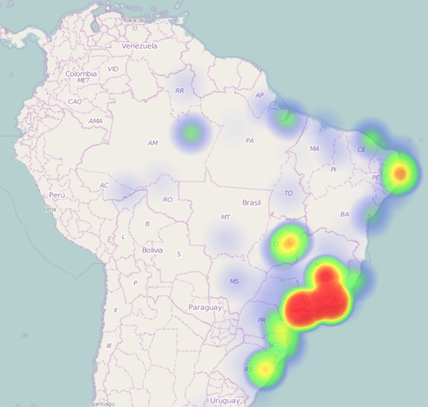

#How to Create Tweets Heatmaps
The complete [tutorial is available here](http://arjon.es/2015/06/20/how-to-create-tweets-heatmaps/).

The final result is a interactive map that looks like this:


##Demo
To run this with the demo data, you just need to run a simple webserver, ie:

```bash
cd web
python -m SimpleHTTPServer 3000
```